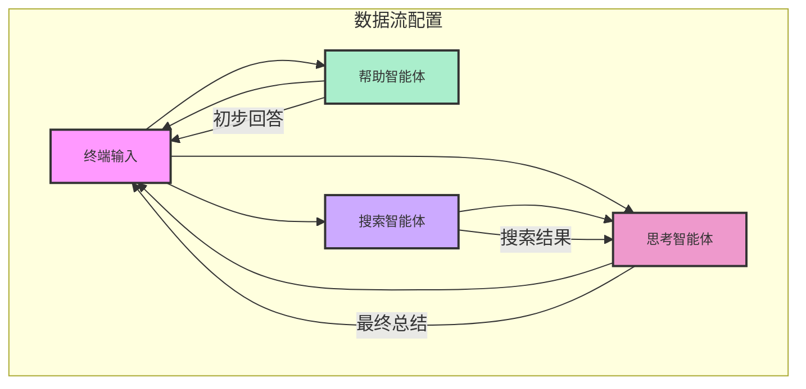

# 急先锋搜索

## 设计理念

一个AI驱动的搜索引擎，以MoFA开发框架搭建，目标定位为在官方渠道和社交媒体上搜寻某个热点话题（可以是气象灾害、应急警报等），由agent整合各渠道信息并反馈给用户。

## 技术架构图

MoFA 框架图


Agent 框架



## 运行指南

### 1 Python 环境

```bash
# 安装 UV 包管理器 加快mofa安装
pip install uv
```

### **注意**: 
- 本地python环境要纯净，不要多个python版本，否则容易导致Dora-rs运行环境和Mofa安装环境的冲突。
- 如果你的环境使用的是Anaconda / Miniconda，务必将Mofa安装到`Base`环境下，以保证Dora运行环境和Mofa环境的一致。
- 要求python环境 >= 3.10。

### 2 Rust 环境
```bash
# 安装 Rust
curl --proto '=https' --tlsv1.2 -sSf https://sh.rustup.rs | sh

# 安装 Dora 运行时
cargo install dora-cli

# 验证安装
rustc --version
cargo --version
dora --version
```

### 3 安装 MoFa

```bash
# 克隆仓库
git clone https://github.com/moxin-org/mofa.git
cd mofa/python

# 安装依赖
uv pip install -e .
pip install -e . 
```

### 4 导入agent

将本仓库的 agent-hub 与 example 导入 MoFA 的对应文件夹

### 4.2 配置环境变量

创建 `.env.secret` 文件(crisis_pioneer_search.yml目录同级进行创建)：
```plaintext
LLM_API_KEY=your_api_key_here
LLM_API_BASE=https://api.openai.com/v1  # 或其他API地址
LLM_MODEL=gpt-3.5-turbo  # 或其他模型名称
```
注：写者使用的是星火大模型

### 5 启动数据流
```bash
cd  /mofa/python/examples/crisis_pioneer_search

# 启动 Dora 服务
dora up

# 构建并运行数据流
dora build crisis_pioneer_search.yml
dora start crisis_pioneer_search.yml
```

### 6 测试交互
```bash
# 在另一个终端运行输入节点
terminal-input

# 输入测试数据
> hello
```

### 7 **运行效果**

```
root@root hello_world % terminal-input                                           
 Send You Task :  你好
-------------llm_result---------------    
……
```

## 架构设计
### 实现Agent逻辑

输入问题->大模型先给出一个简要的回答->必应搜网站、微博、今日头条、腾讯新闻->发给大模型，大模型最后做一次总结

### 数据流配置解释

关于 `crisis_pioneer_search.yml`：
1. terminal-input：

- 作为用户交互入口
- 接收来自三个智能体的输出：初步回答(first_answer)、相关网站列表(relevent_site)和最终分析结果(agent_response)
- 输出用户查询(data)到其他智能体

2. crisis-help-agent：

- 帮助智能体，提供快速初步回答
- 接收用户查询(terminal-input/data)
- 生成初步分析结果(llm_result)

3. crisis-search-agent：

- 搜索智能体，负责从多个平台获取信息
- 接收用户查询(terminal-input/data)
- 输出两种结果：
(1) bing_result：从必应搜索获取的数据
(2) site_result：从其他相关网站(如微博、今日头条)收集的信息

4. crisis-think-agent：

- 思考智能体，整合搜索结果和初步回答
- 接收用户查询(terminal-input/data)和必应搜索结果(crisis-search-agent/bing_result)
- 生成最终综合分析(final_result)
- IS_DATAFLOW_END: true 表示此节点执行完毕后数据流结束，准备接收新的用户输入

### 关键代码说明

1. **使用装饰器**
   - 使用 `@run_agent` 装饰器简化代码结构
   - 自动处理循环和异常

2. **简单的输入输出**
   - 接收单个输入参数 `query`
   - 返回单个输出结果 `llm_result`

3. **错误处理**
   - 使用 try-except 捕获异常
   - 记录错误日志
   - 返回错误信息给用户

### 如何自定义

1. **修改系统提示词**
```python
messages=[
    {"role": "system", "content": "你的自定义系统提示词"},
    {"role": "user", "content": user_input}
]
```

2. **更换LLM提供商**
   - 修改 `.env.secret` 中的 API 配置
   - 根据需要调整模型参数

### 注意事项

1. 确保 `.env.secret` 已添加到 `.gitignore`
2. API密钥要妥善保管
3. 保持代码结构简单清晰

### agent处理流程详解
1. 用户通过 terminal-input 输入应急事件查询
2. 查询分别发送给帮助智能体和搜索智能体
3. 帮助智能体提供初步回答，基于大模型已有知识
4. 搜索智能体在多个渠道检索最新信息
5. 思考智能体整合搜索结果和初步回答，生成最终分析报告
6. 最终分析报告返回给terminal-input显示给用户

### 日志文件位置
- logs/crisis-search-agent.txt: 主智能体运行日志
- logs/search-engine-agent.txt: 搜索智能体日志
- logs/thinking-agent.txt: 思考智能体日志
- logs/dora-coordinator.txt: 协调器日志
- logs/dora-daemon.txt: 守护进程日志


### 项目结构

```
crisis_pioneer_search/
├── agent-hub/
│   ├── crisis-search-agent/
│   │   ├── configs/
│   │   │   └── agent.yml       # 配置文件
│   │   ├── main.py             # 主程序
│   │   └── __init__.py
│   ├── search-engine-agent/
│   │   ├── configs/
│   │   │   └── agent.yml       # 配置文件
│   │   ├── main.py             # 主程序
│   │   └── __init__.py
│   └── thinking-agent/
│       ├── configs/
│       │   └── agent.yml       # 配置文件
│       ├── main.py             # 主程序
│       └── __init__.py
├── examples/
│   └── crisis_pioneer_search.yml  # 数据流配置
├── tests/
│   └── test_agents.py          # 测试代码
├── .env.secret                 # API密钥配置
├── pyproject.toml              # 依赖配置
└── README.md                   # 项目文档
```